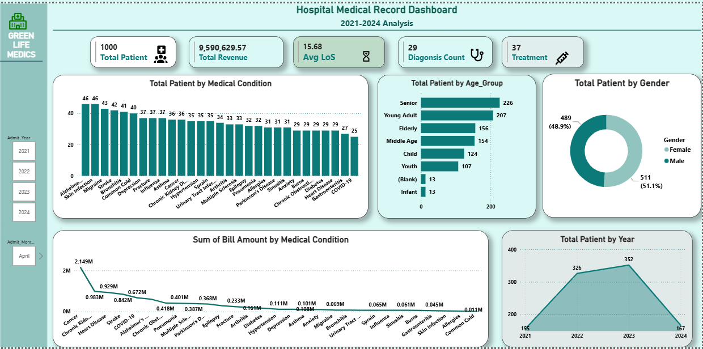
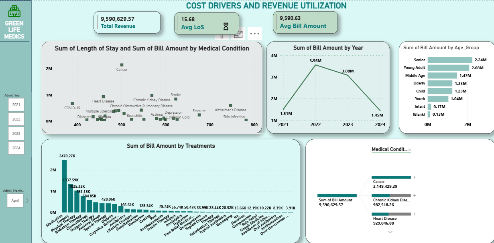

# 🏥 Hospital Records 2021-2024 Analysis (2021–2024)

## 📌 Project Overview

This project analyzes hospital records from 2021 to 2024 to evaluate operational efficiency, patient demographics, treatment utilization, and hospitalization costs. Using microsoft Excel, SQL and Power BI, the project uncovers patterns in patient admissions, identifies key cost drivers, assesses resource utilization, and provides actionable insights to support data-driven healthcare decision-making.

The analysis focuses on two key objectives:

- Predicting hospitalization costs based on patient demographics and medical conditions.
- Analyzing trends in hospital admissions and treatments over time.

---

## 🎯 Business Objectives

This project seeks to answer the following questions:

1. Which medical conditions place the greatest burden on hospital resources?
2. What factors drive hospitalization costs?
3. Which patient groups consume the largest share of healthcare resources?
4. Which treatments provide the shortest average hospital stay?
5. How much revenue is generated by each medical condition?
6. What proportion of hospital revenue comes from long-stay patients?
7. Which patient characteristics are associated with high-cost admissions?
8. How can hospital management improve operational efficiency while maintaining quality of care?

---

## 📂 Dataset Description

The dataset contains patient-level hospital records from 2021 to 2024.

| Column | Description |
|----------|------------|
| Patient ID | Unique patient identifier |
| Gender | Patient gender |
| Date of Birth | Patient birth date |
| Age at Admission | Age at admission |
| Age Group | Categorized age groups |
| Medical Condition | Patient diagnosis |
| Treatment | Treatment administered |
| Doctor's Note | Clinical notes |
| Admit Date | Date of admission |
| Discharge Date | Date of discharge |
| Length of Stay | Number of days hospitalized |
| Admit Year | Admission year |
| Admit Month | Admission month |
| Bill Amount | Hospitalization cost |

---

## 🧹 Data Cleaning & Preparation

The following preprocessing steps were performed:

- Removed duplicate records.
- Standardized date formats.
- Calculated Length of Stay using admission and discharge dates.
- Calculated Age of patients using date of birth and admission date.
- Created Age Group categories.
- Extracted admission year and month from admission dates.
- Validated hospitalization cost records.
- Checked for missing values and inconsistencies.
- Ensured data quality for analysis and reporting.

---

## 🛠️ Tools & Technologies

| Tool | Purpose |
|---------|---------|
| SQL | Data extraction and analysis |
| Power BI | Dashboard development and visualization |
| DAX | KPI calculations and measures |
| Excel | Data validation and exploration |

---

# 📸 Dashboard Preview

## Hospital Operations & Trends

---

## Cost Drivers & Resource Utilization

---

# 📊 Dashboard Structure

## Page 1: Hospital Operations & Trends

### Purpose

Analyze patient demand, hospital activity, and treatment trends over time.

### Key Visuals

- KPI Cards
  - Total Admissions
  - Total Revenue
  - Average Length of Stay
  - Conditions Treated
  - Treatments Used

- Admissions Trend Analysis
- Revenue Trend Analysis
- Medical Condition Trends
- Age Group Distribution
- Treatment Utilization Analysis

### Business Insight

This page helps stakeholders understand how hospital activity evolved between 2021 and 2024 and identifies major drivers of patient demand.

---

## Page 2: Cost Drivers & Resource Utilization

### Purpose

Identify the factors contributing to hospitalization costs and resource consumption.

### Key Visuals

- Length of Stay vs Bill Amount Scatter Plot
- Revenue by Medical Condition
- Cost by Age Group
- Revenue Contribution by Stay Category
- Medical Condition Cost Analysis
- Cost Heatmap by Age Group and Medical Condition
- Decomposition Tree for Cost Drivers

### Business Insight

This page reveals which conditions, treatments, and patient groups generate the highest costs and consume the most hospital resources.

---

# 🔍 SQL Analysis

The analysis was conducted using SQL to answer key business questions such as:

- Admissions trends by year and month
- Revenue generation by medical condition
- Average length of stay by condition
- Cost analysis by age group and gender
- Treatment utilization patterns
- Resource consumption across patient age groups
- High-cost patient identification

---

# 📈 Key Findings

- Hospital admissions increased steadily from 2021 to 2023 and declined in 2024.
- The senior patients accounted for majority of hospital admissions, suggesting that healthcare demand was higher among them.
- Alzhimer's disease and Skin infection are the medical conditions that accounted for majority of hospital admissioin,         indicating that these medical conditions place the greatest burden on hospital services.
- Cancer and Chronic Kidney Disease accounted for a significant rise in revenue.
- Length of stay was not strongly associated with hospitalization costs. 
- Senior patients incurred higher hospitalization costs than younger patient.
- Medication and sugery were performed more frequenlty than other treatments, reflecting the prevalence of specific medical    conditions.

---

# 💡 Recommendations

1. Improve discharge planning to reduce unnecessary hospitalization days.
2. Closely monitor patients with chronic conditions who are at higher risk of prolonged stays and elevated costs.
3. Allocate resources efficiently to departments handling high-volume medical conditions.
4. Expand the adoption of treatments associated with shorter hospital stays.
5. Continuously monitor patient demand trends to improve staffing and capacity planning.

---

# 🚀 Skills Demonstrated

- Data Cleaning
- Data Transformation
- SQL Querying
- Exploratory Data Analysis
- Healthcare Analytics
- Data Visualization
- Dashboard Design
- DAX Calculations
- Data Storytelling
- KPI Development

---

# 📌 Conclusion

This project demonstrates how healthcare data can be transformed into actionable insights using SQL and Power BI. The analysis provides valuable information on patient demand, treatment utilization, hospitalization costs, and operational performance. These insights can support healthcare administrators in improving efficiency, optimizing resource allocation, and enhancing patient care outcomes.

---
